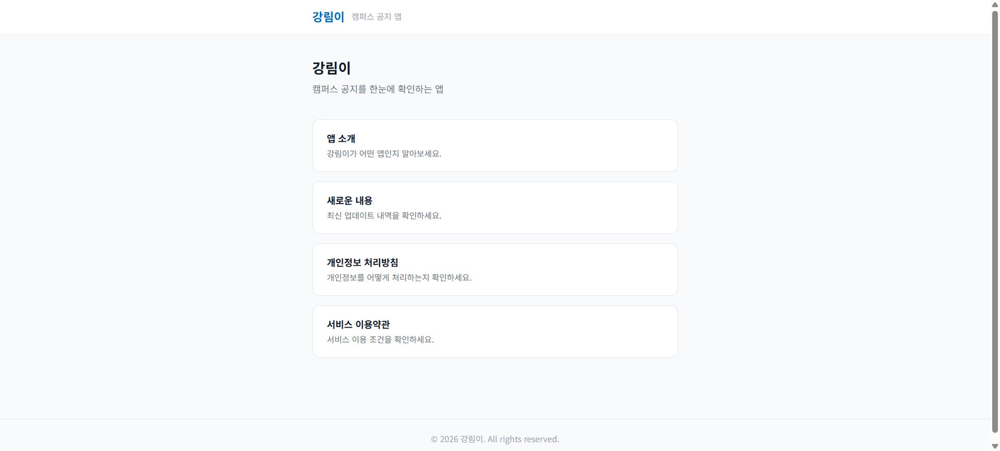

# 강림이 웹

<p align="center">
  
</p>

강남대학교 공지 통합 앱 **강림이**의 공식 웹사이트입니다.

앱 소개, 업데이트 내역, 개인정보 처리방침, 서비스 이용약관을 제공합니다.

## 강림이 앱 소개

**강림이**는 강남대학교 + 알림이의 줄임말로, 흩어진 캠퍼스 공지를 한눈에 모아주는 모바일 앱입니다.

학교 본부 6개 카테고리와 20개 학과 게시판, 총 26개 채널을 하나의 피드로 통합하고 30분마다 자동 업데이트합니다.

### 핵심 기능

| 기능 | 설명 |
|------|------|
| 통합 공지 피드 | 26개 채널을 하나의 피드로 제공, 30분마다 자동 업데이트 |
| 빠른 검색 & 필터 | 실시간 검색, 카테고리·학과·날짜 필터 지원 |
| 개인화 알림 | 관심 카테고리·학과를 선택해 필요한 공지만 알림 수신 |
| 북마크 & 읽음 표시 | 나중에 볼 공지 저장, 읽은 공지 자동 구분 |
| 캠퍼스 맵 | 네이버 지도로 강남대 주요 건물 20개 이상 위치 안내 |

## 기술 스택

- **프레임워크**: Next.js 14 (App Router)
- **언어**: TypeScript
- **스타일**: Tailwind CSS

## 시작하기

```bash
npm install
npm run dev
```

`http://localhost:3000`에서 확인할 수 있습니다.

## 페이지 구성

| 경로 | 내용 |
|------|------|
| `/` | 홈 |
| `/intro` | 앱 소개 |
| `/changelog` | 업데이트 내역 |
| `/privacy` | 개인정보 처리방침 |
| `/terms` | 서비스 이용약관 |

## 라이선스

© 2026 강림이. All rights reserved.
